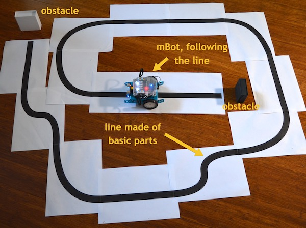

# Section 1

---

## Chapter 5: A quick demonstration

---

**In this chapter you will learn about:**

* How to use the remote controller for starting one of the demo programs that ship with the mBot

---

**This is a hand-on activity.**

You will not need any tools.

You will need the infrared remote controller the came with the kit, and the assembled mBot with a full set of batteries.

---

Now that your mBot is assembled, how about you take it for a ride? You don't have to do any programming at all, because the mBot comes with demonstration programs already installed, out of the box. To play with them, you will need your mBot infrared remote control and the fold-out sheet of paper with the black line printed on it that is included in the kit.

Let's start with the first demonstration mode: remote control car!

\[Image 5.1: The remote controller allows you to activate the build-in demonstration programs on the mBot\]

### Remote control car mode

Turn on your mBot and place it on the floor. Make sure the the coin-cell \(CR2025\) battery is properly inserted in the remote controller. Then, point the remote controller towards the mBot, and press the "A" key. This will enable the remote control car mode.

Now press any of the directional keys, and see how your mBot responds by moving accordingly. Have a bit of fun with this mode before moving to the next one.

### Obstacle avoidance mode

Put a few objects on the floor around your mBot, and press the "B" key on the remote controller. This will start the obstacle avoidance program. Your mBot will start moving in a straight line, but as soon as it gets close to an obstacle it will stop and turn a different direction, then move forwards again. It will keep doing that until you turn it off, or change the program that is running on it.

The obstacle avoidance program uses the distance sensor to detect obstacles in front of it, and changes course when it gets to close to one of them. Later in this book you will learn how to program this kind of behaviour.

\[Image 5.2: The mBot program B helps the mBot avoid obstacles\]

---

**Question 5.1: Pick up the mBot, while it is operating in obstacle avoidance mode. Hold it in a way that its wheels are free to turn. Use the palm of your hand as a target, and hold it steadily infront of the distance sensor. Notice how the motion of the wheels change depending on the distance between your hand and the sensor? Use a tape measure or ruler and measure the distance between your palm and the sensor that causes the wheels to change the way that they rotate.**

The distance you measured is \_\_\_\_\_\_\_\_\_\_\_ cm.

_Answer: Students should measure a distance of around 20-30 cm._

---

### Line follower

Next, try out the line follower program. Place the provided \(part of the kit\) sheet of paper with the large "8" figure printed on it on the floor, and place your mBot somewhere on the line. The line-following module should be over the line. Turn the mBot on and press the "C" key on the remote controller.

The mBot will start zooming over the line, without going off it. It will keep going until you press "A" to enable the remote control program again.

\[Image 5.3: The mBot program C helps the mBot to follow a line\]

How about you create your own line on the floor?

**You can use the line segments that we supply at the end of this book**, or print yours out and create any kind of line you like for your mBot to follow. Here's one I made:

\[Image 5.4: A line made from the basic line parts that ship with this book\]

In the second part of this book you will learn how to implement this kind of behaviour on your mBot. Yes, you will learn how to program your mBot to follow a line!

Fun, isn't it? To stop the mBot, press the "A" button on the remote controller to go back into manual control mode.I encourage you to play around with your mBot and the programs that come with it at available budgets using the A, B and C buttons on your remote control and the directional buttons to control its direction.

In the next chapter, I'm going to show you how you can do some simple programming on the mBot using the Scratch graphical programming language on an iPad.

---

**Question 5.2: Try to find out how narrow a turn can be before the mBot is unable to follow it. Use a black marker and draw a sharp bent on a A4 piece of printer paper. Alternatively, you can use a program on your computer, like Microsoft Powerpoint or Apple Keynote to draw this bend. Draw a few variations \(wide bend, medium bend, and sharp bend\). Then test your mbot. Was it able to follow the line around the bend? How sharp can the turn get before the mBot looses the line? When you find the sharpest bend the the mbot can negotiate, measure it radius and angle.**

Here's an example of one of my experiments:

\[Image 5.5: Record of an experiment for determining the mBot's maximum turning capacity\]

Diameter: \_\_\_\_\_\_\_\_\_\_ cm

Angle:      \_\_\_\_\_\_\_\_\_\_\_ degrees

_Answer: A turn of 10cm \(radius\) and 90 degrees is well within the mBot's ability to do._

---

**Checklist**

Double-check that at this point, the following are completed:

\[   \] Tested the mBot: it turns on, it's wheels are turning as expected and sensors are working properly

\[   \] Tested the infrared remote control. You can use it to control your mBot

\[   \] Tested the 3 built-in programs that ship with the mBot, and are working well.

---

